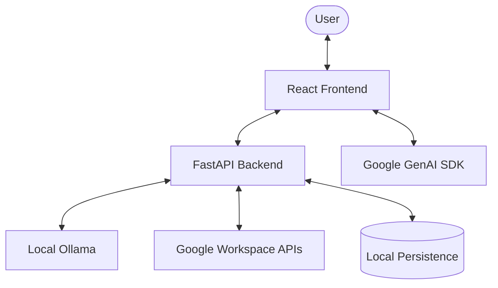

# Project Architecture: Flowstate Hub

Flowstate is a hybrid, sovereign productivity hub that bridges Google Workspace (online) and local AI (offline) to automate research and triage tasks.

## System Overview

The project follows a decoupled architecture with a React-based frontend and a Python-based FastAPI backend. It integrates local LLMs (via Ollama) and Google Workspace APIs for a unified productivity experience.

---

## Architecture Breakdown

### 1. Frontend (React + Vite + TypeScript)
The frontend is a modern, responsive web application built with React. It features a widget-based UI and a persistent chat interface.

- **Framework**: React 19 with Vite for build tooling.
- **State Management**: React Hooks (useState, useEffect) are used for local component state.
- **Key Components**:
    - `App.tsx`: Main application shell and layout.
    - `ChatArea.tsx`: Core interaction hub for chat and widget orchestration.
    - `Sidebar.tsx`: Navigation and global controls.
    - `DraggableWidgetWrapper.tsx`: Enables free-form layout of widgets.
- **Widgets**:
    - `CalendarWidget`: Displays and manages Google Calendar events.
    - `EmailWidget`: Provides a triage view for Gmail.
    - `NotesWidget`: Local note-taking functionality.
    - `DriveWidget`: Integration with Google Drive.
    - `ClockWidget`, `StockWidget`: Utility widgets.
- **Services**:
    - `agentService.ts`: Orchestrates communication between frontend, backend, and Google GenAI.
    - **Search Grounding**: Utilizes `@google/genai` (Gemini) directly in the frontend for client-side search grounding.

### 2. Backend (FastAPI + Python)
The backend acts as a secure intermediary for local AI operations and Google Workspace interactions.

- **Framework**: FastAPI.
- **Core Services**:
    - `main.py`: Entry point and API routing.
    - `agent_orchestrator.py`: **[NEW]** Modular orchestrator that manages "Agent Cards" for specialized tasks (following Google ADK patterns).
    - `auth_service.py`: Manages Google OAuth2 flow.
- **Local AI Integration**:
    - Integrates with **Ollama** or **vLLM** via a hardware-agnostic LLM abstraction.
    - Supports **AMD Instinct GPUs**, **NVIDIA CUDA**, and **Intel (CPU/GPU)**.
    - Default model: `llama3.2` (optimized for local performance).
- **Task Management**:
    - Implements an asynchronous task queue with persistence in `tasks.json`.
    - Features a background monitor thread that resumes queued tasks once internet connectivity is restored.

### 3. AI & Integration Flow
Flowstate uses a "Hybrid, Cross-Platform AI" approach:
- **Local AI (Ollama/vLLM)**: Handles "sovereign" tasks like planning and data extraction. Optimized for AMD (ROCm), NVIDIA (CUDA), and Intel.
- **Cloud AI (Gemini)**: Handles search grounding and high-context web research client-side.
- **Orchestration**: The `AgentOrchestrator` decomposes user requests into tasks executed by specialized agent cards (Calendar, Gmail).

### 4. Data Flow & Persistence
- **State**: The application state is synchronized between the frontend (React) and the backend (FastAPI).
- **Local Storage**:
    - `tasks.json`: Persistent queue of user requests and their execution status.
    - `settings.json`: Persistent user preferences.
    - `token.json`: Secure storage for Google OAuth2 tokens.
- **External Data**: Google Workspace data is fetched on-demand and cached minimally in-memory or summarized by the AI.

---

## Technology Stack

| Layer | Technology |
| :--- | :--- |
| **Frontend** | React 19, Vite, TypeScript, Tailwind CSS |
| **Backend** | Python 3.x, FastAPI, Agent Orchestrator (Google ADK) |
| **AI (Hardware)** | **AMD ROCm**, **NVIDIA CUDA**, **Intel (CPU/OpenVINO)** |
| **AI (Serving)** | **Ollama**, **vLLM** (OpenAI-compatible) |
| **AI (Models)** | Llama 3.2 (Local), Gemini 2.0 Flash (Cloud Research) |
| **APIs** | Google Calendar API, Gmail API, Google Drive API |
| **Tools** | chrono-node (Date Parsing), react-markdown |
